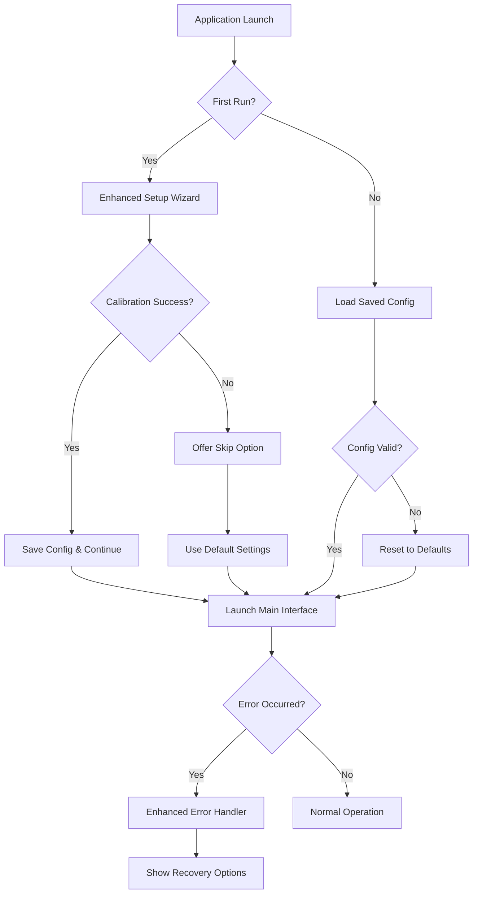
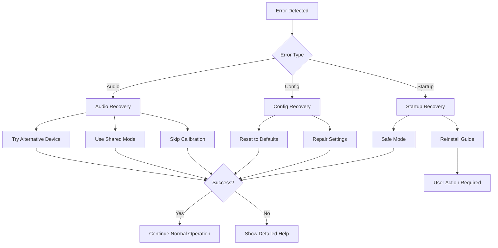

# Design Document

## Overview

This design addresses critical user experience issues in the Switch Interface by implementing a more robust first-run experience, comprehensive error handling, production-ready layouts, and improved documentation. The solution focuses on reducing barriers to entry for users with disabilities while maintaining the application's core functionality.

## Architecture

### Component Overview

The improvements span multiple components of the existing Switch Interface architecture:

1. **Setup Wizard Enhancement** - Modified `gui.py` FirstRunWizard class
2. **Layout Management** - New production layouts and improved default selection
3. **Error Handling System** - Enhanced error recovery in launcher and main application
4. **Configuration Management** - Improved defaults and fallback mechanisms
5. **Documentation System** - Comprehensive user guides and troubleshooting

### Data Flow



## Components and Interfaces

### 1. Enhanced Setup Wizard

**Location:** `switch_interface/gui.py`

**Key Changes:**
- Add "Skip Calibration" button in calibration step
- Implement fallback configuration when calibration fails
- Provide clearer error messages and recovery options
- Add progress indicators and help text

**Interface:**
```python
class EnhancedFirstRunWizard(FirstRunWizard):
    def _step_calibration(self) -> tk.Frame:
        # Add skip option and better error handling
   
      # Enhanced calibration step with skip option
        pass
    
    def _add_skip_calibration_option(self) -> None:
        # Allow users to bypass calibration with defaults
        pass
```

### 2. Production Layout System

**Location:** `switch_interface/resources/layouts/`

**New Layouts:**
- `qwerty_full.json` - Complete QWERTY with predictive text, numbers, punctuation
- `simple_alphabet.json` - Beginner-friendly alphabetical layout
- Enhanced existing layouts with missing essential keys

**Default Selection Logic:**
```python
def get_default_layout() -> str:
    """Return the best default layout for new users."""
    preferred_order = [
        "qwerty_full.json",
        "pred_test.json", 
        "basic_test.json"
    ]
    # Return first available layout from preferred list
```

### 3. Enhanced Error Handling

**Location:** `switch_interface/launcher.py`, `switch_interface/__main__.py`

**Key Features:**
- Graceful error recovery with user-friendly messages
- Launcher remains open on errors for retry
- Specific troubleshooting suggestions
- Fallback modes when hardware fails

**Error Handler Interface:**
```python
class ErrorHandler:
    def handle_startup_error(self, error: Exception) -> None:
        # Show user-friendly error with solutions
        pass
    
    def handle_audio_error(self, error: Exception) -> None:
        # Specific audio troubleshooting
        pass
    
    def offer_safe_mode(self) -> bool:
        # Provide minimal functionality fallback
        pass
```

### 4. Configuration Management

**Location:** `switch_interface/config.py`

**Improvements:**
- Better default values for new users
- Fallback configuration when settings are corrupted
- Validation and auto-repair of configuration files

**Configuration Schema:**
```python
DEFAULT_CONFIG = {
    "scan_interval": 0.6,  # Slower for beginners
    "layout": "qwerty_full.json",
    "row_column_scan": False,
    "calibration_complete": False,
    "audio_device": None,
    "fallback_mode": False
}
```

## Data Models

### Enhanced Configuration Model

```python
@dataclass
class UserConfig:
    scan_interval: float = 0.6
    layout_path: str = "qwerty_full.json"
    row_column_scan: bool = False
    calibration_complete: bool = False
    audio_device: Optional[str] = None
    fallback_mode: bool = False
    
    def validate(self) -> bool:
        """Validate configuration and repair if needed."""
        pass
    
    def get_safe_defaults(self) -> 'UserConfig':
        """Return minimal working configuration."""
        pass
```

### Layout Metadata Model

```python
@dataclass
class LayoutInfo:
    filename: str
    display_name: str
    description: str
    difficulty_level: str  # "beginner", "intermediate", "advanced"
    features: List[str]    # ["predictive_text", "numbers", "symbols"]
    
    @classmethod
    def from_layout_file(cls, path: Path) -> 'LayoutInfo':
        """Extract metadata from layout JSON."""
        pass
```

## Error Handling

### Error Categories and Responses

1. **Audio Device Errors**
   - No microphone detected → Guide to device selection
   - Exclusive mode failed → Auto-fallback to shared mode
   - Calibration failed → Offer skip with defaults

2. **Configuration Errors**
   - Corrupted config file → Reset to defaults with user notification
   - Missing layout file → Fall back to bundled layouts
   - Invalid settings → Validate and repair automatically

3. **Startup Errors**
   - Missing dependencies → Clear installation instructions
   - Permission issues → Specific troubleshooting steps
   - Unexpected crashes → Safe mode option

### Error Recovery Flow



## Testing Strategy

### Unit Tests
- Configuration validation and repair
- Layout loading and fallback mechanisms
- Error handler response accuracy
- Default value correctness

### Integration Tests
- First-run wizard flow with various failure scenarios
- Audio device switching and fallback modes
- Layout selection and loading
- Error recovery end-to-end flows

### User Acceptance Tests
- New user can complete setup without technical knowledge
- Users can recover from common error scenarios
- Layouts provide complete typing functionality
- Documentation guides users through troubleshooting

### Accessibility Tests
- Screen reader compatibility with new UI elements
- Keyboard navigation through setup wizard
- High contrast mode support
- Motor accessibility with longer timeouts

## Implementation Phases

### Phase 1: Core Infrastructure
- Enhanced error handling system
- Configuration validation and repair
- Improved default settings

### Phase 2: User Experience
- Setup wizard improvements
- Production-ready layouts
- Better error messages

### Phase 3: Documentation and Polish
- Comprehensive user guides
- Troubleshooting documentation
- Visual improvements and accessibility

## Security Considerations

- Configuration files stored in user directory with appropriate permissions
- Audio device access follows system security policies
- No sensitive data stored in configuration
- Safe handling of user input in custom layouts

## Performance Considerations

- Layout loading optimized for startup time
- Error handling doesn't impact normal operation performance
- Configuration validation is lightweight
- Fallback modes maintain responsive user interface

## Compatibility

- Maintains backward compatibility with existing configurations
- Graceful handling of old layout formats
- Supports Windows, macOS, and Linux audio systems
- Compatible with existing assistive technology workflows